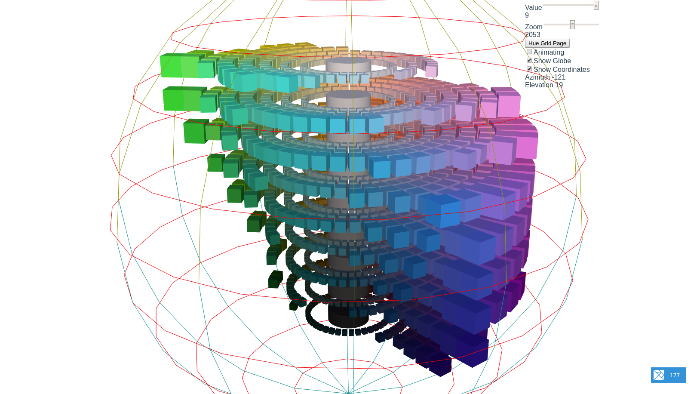

# color_space Application

An Elm-WebGL application to explore Munsell color space.

Now refactored to use [Ian Mackenzie's WebGL libraries](https://github.com/ianmackenzie/elm-3d-scene).

The web application has two views:

1. A color sphere, where lines of latitude on the sphere correspond to Munsell values
(light at the North Pole, dark at the South Pole).

2. Two-sided hue page, showing selected hue and clockwise and counter-clockwise neighbors.

## Requirements

This application uses as-yet-unreleased Elm package `ianmackenzie/elm-3d-scene`.

To compile, clone the elm-3d-scene package from https://github.com/ianmackenzie/elm-3d-scene into a
scratch directory and then copy the Elm source files (recursively) from `src` into the
`elm-3d-scene/src` directory in this project.

## To build and run

This project is bootstrapped with [Create Elm App](https://github.com/halfzebra/create-elm-app).

To run a development server, install `create-elm-app` as and then run `elm-app start`.

The full guide to using `create-elm-app` is [here](https://github.com/halfzebra/create-elm-app/blob/master/template/README.md)

## Notes

The source for the Munsell-to-sRGB/dRGB conversion table is from the RIT Munsell website:
https://www.rit.edu/cos/colorscience/rc_munsell_renotation.php

The direct file link (located in the section named "real.dat") is
http://www.rit-mcsl.org/MunsellRenotation/real_sRGB.xls

Also, Paul Centore's website has a ton of color science data, programs, etc:
http://www.munsellcolourscienceforpainters.com/MunsellAndKubelkaMunkToolbox/MunsellAndKubelkaMunkToolbox.html

On Centore's "Munsell Resources" page is another conversion file with slightly different color values on it:
http://www.munsellcolourscienceforpainters.com/MunsellAndKubelkaMunkToolbox/MunsellAndKubelkaMunkToolboxFeb2017/DataFiles/MunsellRenotationTosRGB.txt
